# Tăng Cỡ Chữ - Big Font

## 📱 Giới thiệu

**Tăng Cỡ Chữ - Big Font** là ứng dụng được phát triển bằng **Java** và **XML** trên nền tảng Android với mục tiêu mang đến cho người dùng trải nghiệm **thân thiện – linh hoạt – hiệu quả**. Ứng dụng cho phép người dùng
*tùy chỉnh kích cỡ phông chữ hệ thống* để dễ đọc và phù hợp với từng người. *Thay đổi theme ứng dụng* theo sở thích hoặc điều kiện sử dụng. *Hỗ trợ đa ngôn ngữ* cho nhiều quốc gia và đối tượng người dùng.  
👉 Ứng dụng được tạo ra nhằm **tối ưu trải nghiệm cá nhân hóa**, giúp mọi người dễ dàng điều chỉnh theo nhu cầu mà không bị giới hạn bởi mặc định hệ thống.  

## 📸 Ảnh chụp giao diện ứng dụng
<table style="width:100%; table-layout:fixed; text-align:center;">
  <tr>
    <td>Yêu cầu quền cài đặt</td>
    <td>Trang cấp quyền</td>
    <td>Trang chủ</td>
  </tr>
  <tr>
    <td>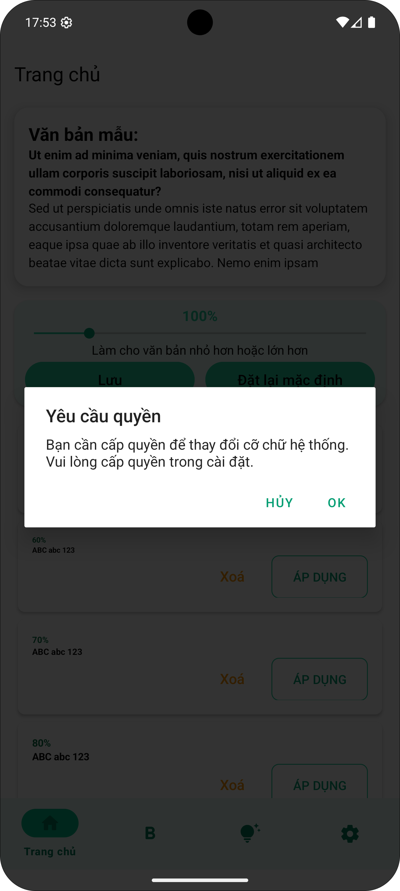</td>
    <td>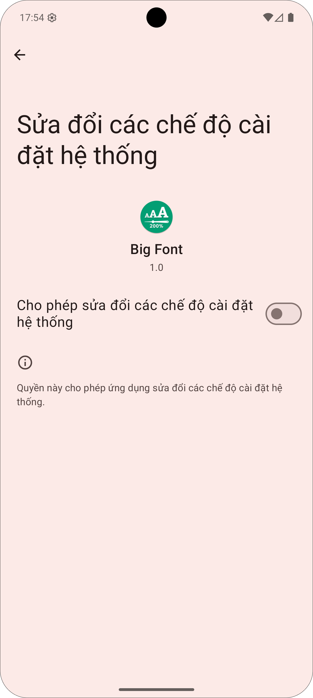</td>
    <td>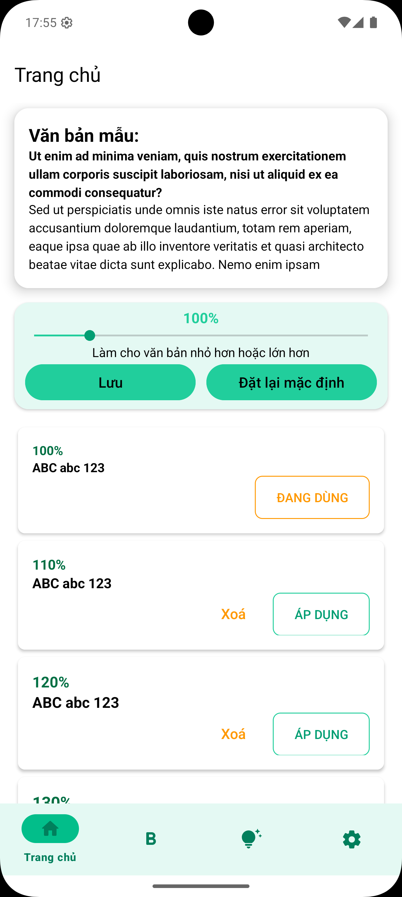</td>
  </tr>
  <tr>
    <td colspan="3"></td>
  </tr>
  <tr>
    <td>Trang độ dày phông chữ</td>
    <td>Mẹo gợi ý</td>
    <td>Chi tiết mẹo</td>
  </tr>
  <tr>
    <td>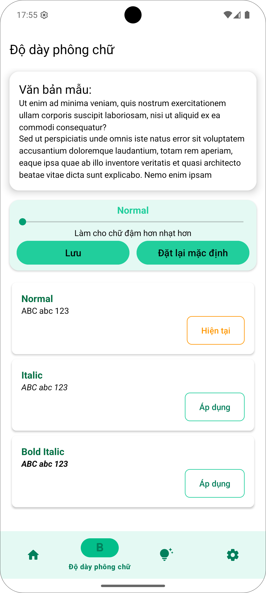</td>
    <td>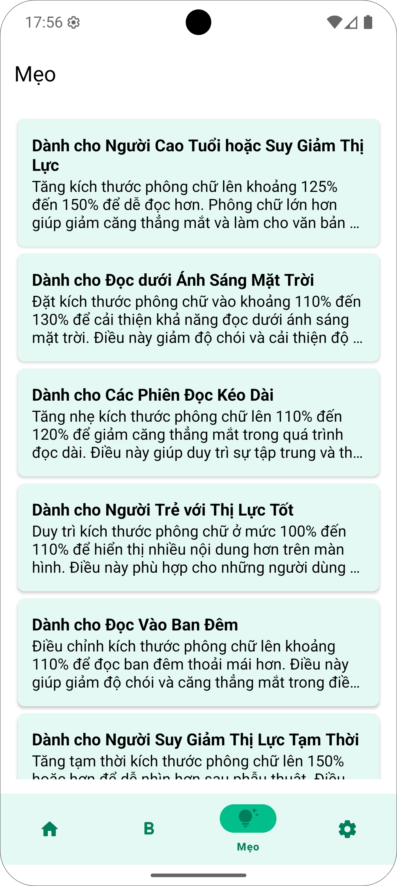</td>
    <td>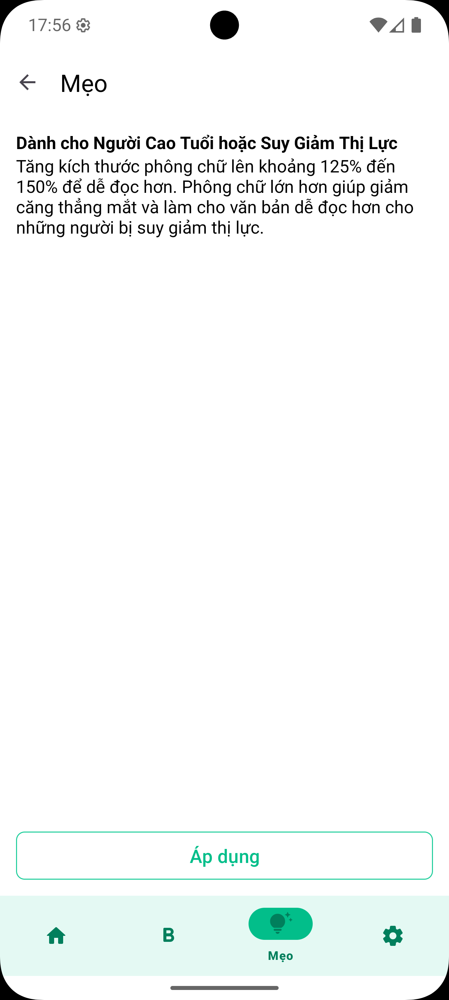</td>
  </tr>
  <tr>
    <td colspan="3"></td>
  </tr>
  <tr>
    <td>Trang cài đặt</td>
    <td>Cài đặt ngôn ngữ</td>
    <td>Chế độ nền tối</td>
  </tr>
  <tr>
    <td>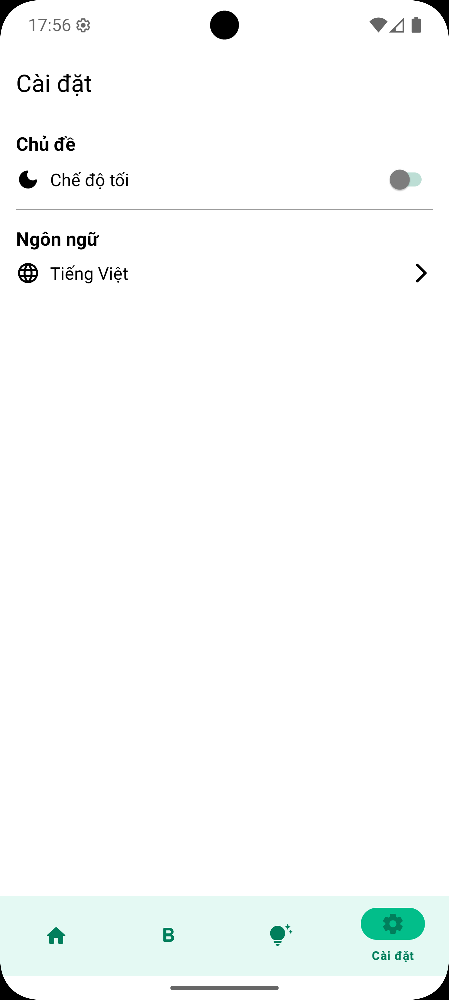</td>
    <td>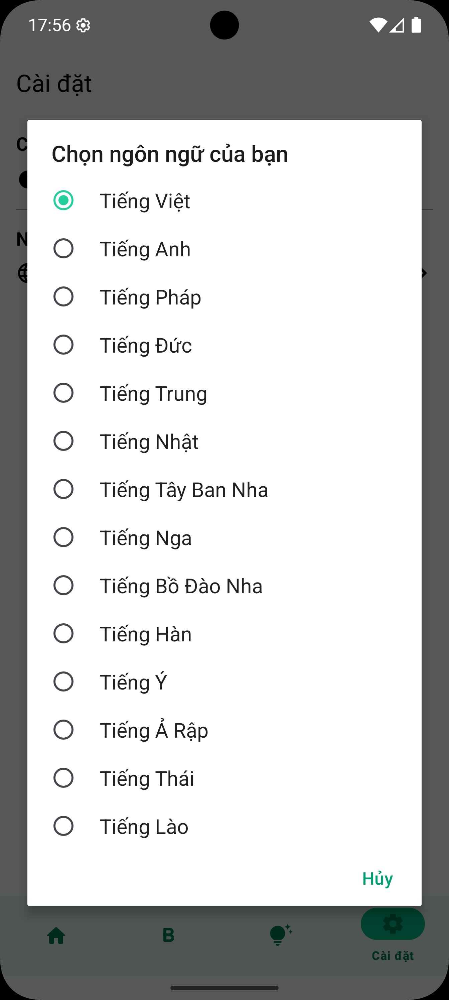</td>
    <td>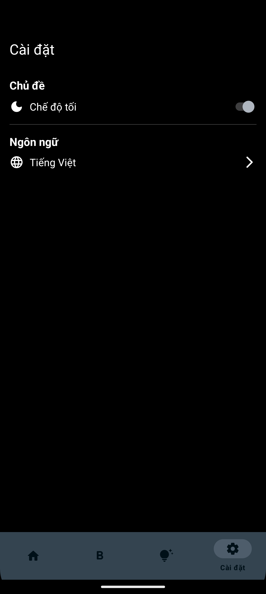</td>
  </tr>
  <tr>
    <td colspan="3"></td>
  </tr>
  <tr>
    <td>Chế độ nền tối</td>
    <td>Chế độ nền tối</td>
    <td>Áp dụng ngôn ngữ</td>
  </tr>
  <tr>
    <td>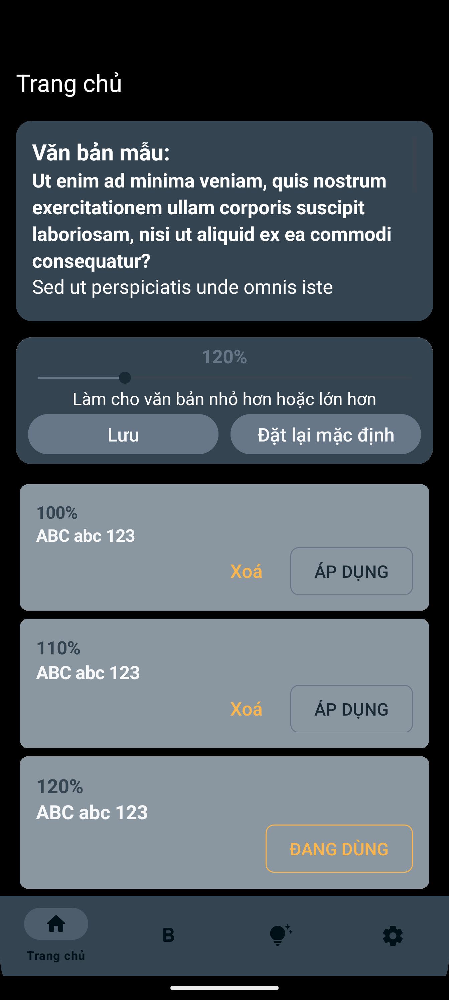</td>
    <td>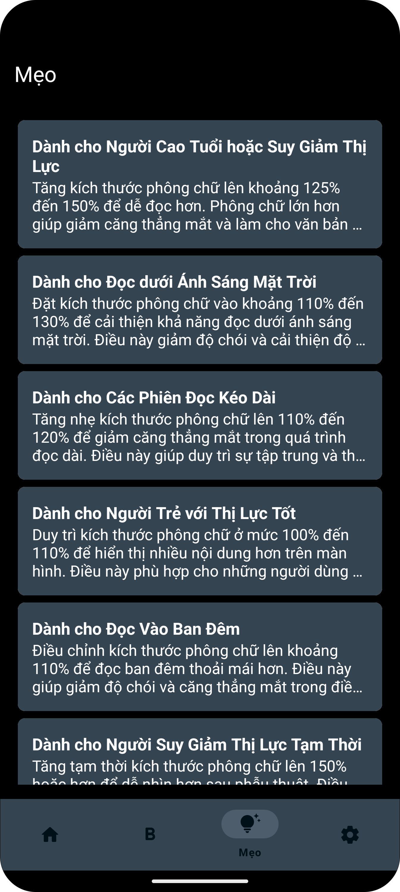</td>
    <td>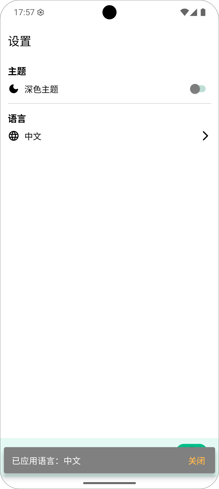</td>
  </tr>
  </tr>
  <tr>
    <td colspan="3"></td>
  </tr>
  <tr>
    <td>Ngôn ngữ Trung</td>
    <td>Ngôn ngữ Lào</td>
    <td>Thay đổi cỡ chữ - thu nhỏ</td>
  </tr>
  <tr>
    <td>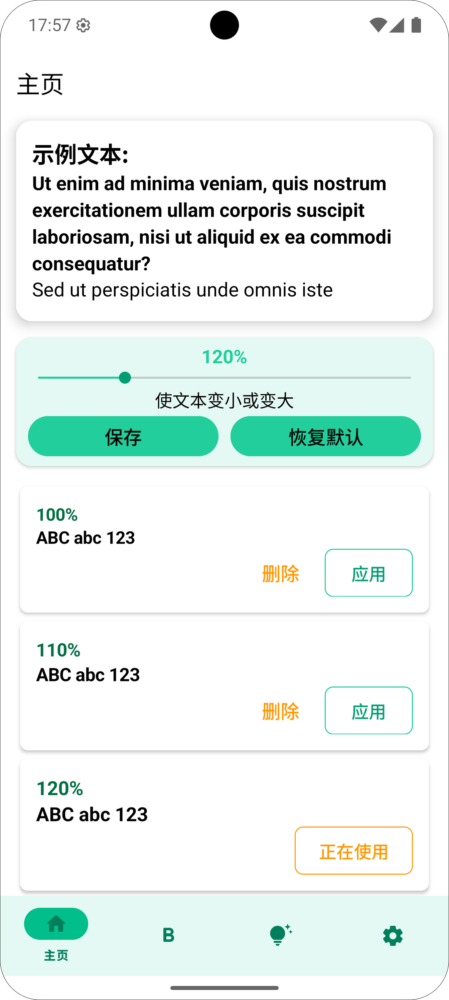</td>
    <td>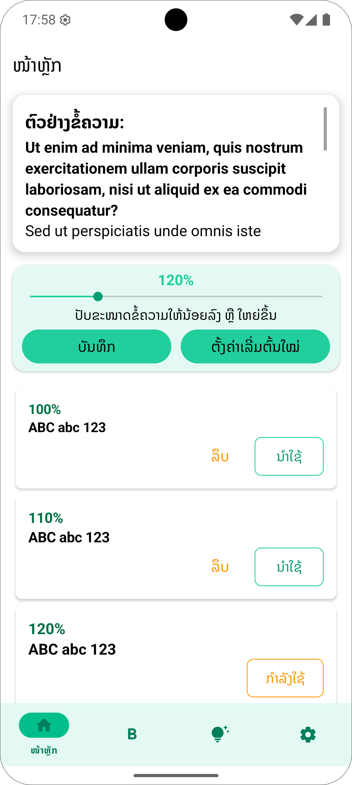</td>
    <td>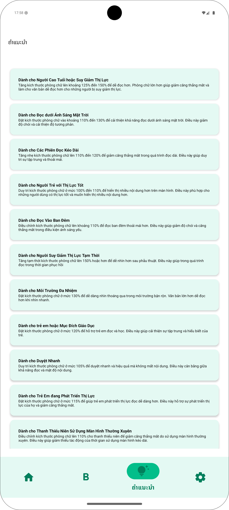</td>
  </tr>
  <tr>
    <td colspan="3"></td>
  </tr>
  <tr>
    <td>Thay đổi cỡ chữ - phóng to</td>
    <td>Kết quả</td>
    <td>Kết quả</td>
  </tr>
  <tr>
    <td>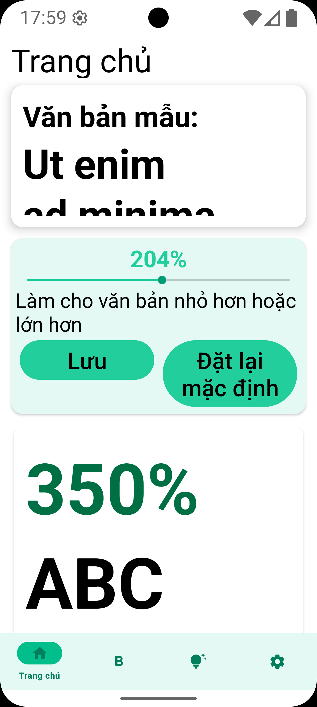</td>
    <td>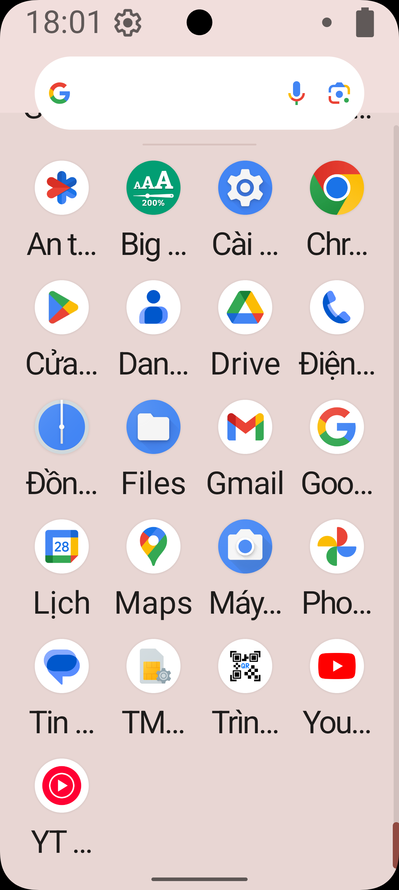</td>
    <td>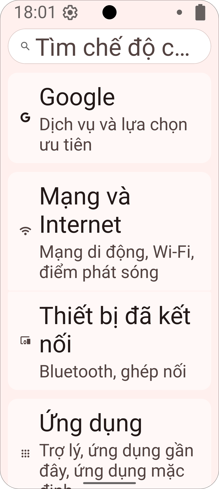</td>
  </tr>
  </table>
  
## 🔥 Chức năng chính
- Thay đổi cỡ chữ(áp dụng cỡ chữ phổ biến hoặc tự tạo cỡ chữ riêng bằng cách kéo thanh ngang trên màn hình)
- Tạo mới, xoá cỡ chữ
- **Thay đổi độ dày chữ(Đang trong quá trình hoàn thiện....)**
- Áp dụng cỡ chữ được gợi ý
- Thay đổi ngôn ngữ(Bao gồm: Tiếng Việt, tiếng Anh, tiếng Trung giản thể, tiếng Thái, tiếng Lào, tiếng Nga, tiếng Pháp, tiếng Bồ Đào Nha, tiếng Ý, tiếng Đức, tiếng Hàn, tiếng Nhật, tiếng Ả Rập, tiếng Tây Ban Nha)
- Thay đổi chế độ sáng-tối

## 🛠 Công nghệ sử dụng

### Android Studio
- **Ngôn ngữ**: Java
- **Thư viện chính**: room, live data

### Database
- Room Database, Share preference
  
### Công cụ hỗ trợ
- **Thiết kế UI/UX**: Figma
- **IDE**: Android Studio
- **Version Control**: GitHub


## 🚀 Cài đặt và chạy ứng dụng

### Yêu cầu hệ thống
- Android Studio bản Iguana/Jellyfish/Koala/Ladybug/Narwhal hoặc mới hơn
- Android SDK 24+
- JDK 11+

### Các bước cài đặt
1. Clone repository:
   ```bash
   git clone https://github.com/chaolaolo/BigFont.git
   ```
2. Mở project bằng Android Studio
3. Đồng bộ Gradle và tải các dependencies
4. Chạy ứng dụng trên máy ảo hoặc thiết bị thật


**Liên hệ với tôi**: 
- Chảo Láo Lở - [chaolaolo290604@gmail.com](mailto:chaolaolo290604@gmail.com).
- Phone: 0396471382
